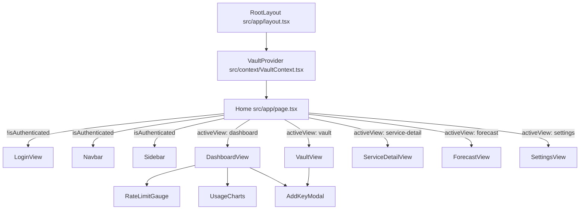
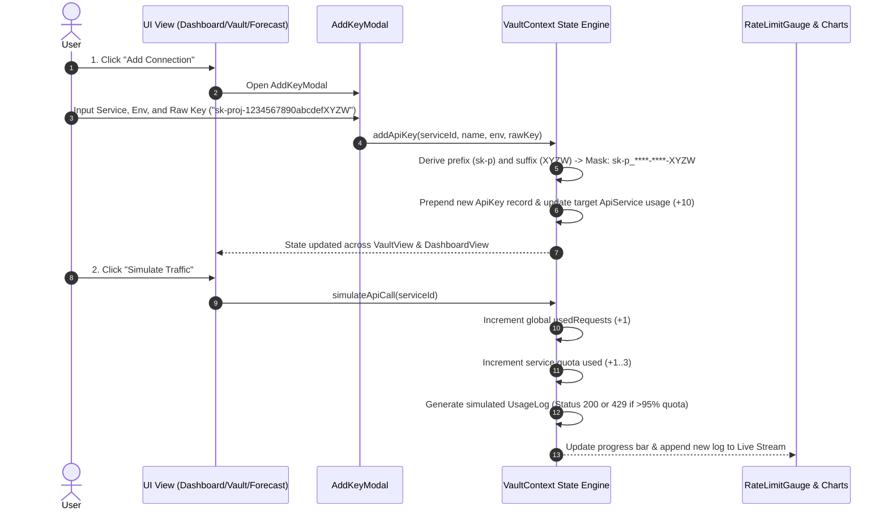
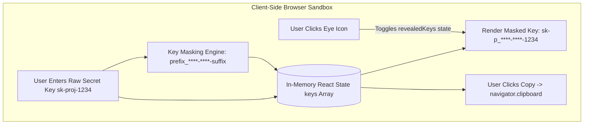
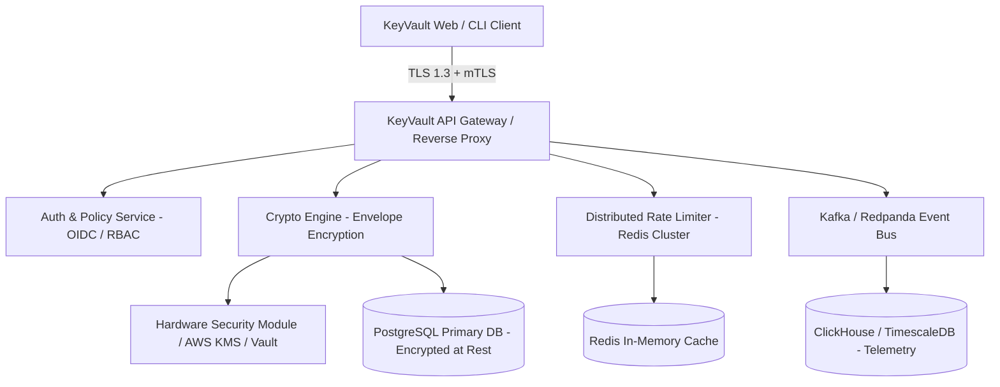
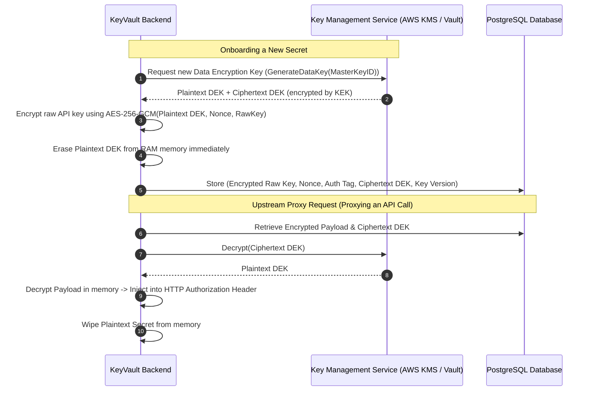

# KeyVault Architectural Blueprint & Technical Deep Dive

---

## 1. Repository Discovery & Ground Truth

Reconstructed directly from the codebase repository (`/Users/venkatatejeshreddy/PROJECT-EXPO`):

```
PROJECT-EXPO/
├── package.json              # Next.js 16.3.3, React 19.2.8, Tailwind CSS v4, Recharts, Lucide
├── tsconfig.json             # TypeScript compiler config (ES2017 target, strict mode)
├── next.config.ts            # Next.js server configuration
├── postcss.config.mjs        # Tailwind v4 PostCSS plugin integration
├── src/
│   ├── app/
│   │   ├── layout.tsx        # HTML root wrapper & VaultProvider injector
│   │   ├── page.tsx          # Dynamic view router based on authentication & active view state
│   │   └── globals.css       # Design tokens, keyframe animations, dark/light theme variables
│   ├── context/
│   │   └── VaultContext.tsx  # Central reactive state engine & simulation controller
│   ├── types/
│   │   └── index.ts          # Core domain models (Services, Keys, Logs, Forecasts, RateLimits)
│   ├── lib/
│   │   └── mockData.ts       # Initial telemetry datasets, velocity algorithms & forecast models
│   └── components/
│       ├── Navbar.tsx        # Global telemetry breadcrumb, tier indicator, alerts & theme toggle
│       ├── Sidebar.tsx       # Navigation dispatcher & vault health summary widget
│       ├── modals/
│       │   └── AddKeyModal.tsx # Key onboarding, prefix/suffix masking & validation modal
│       ├── widgets/
│       │   ├── RateLimitGauge.tsx # Real-time token-bucket rate limit visualization
│       │   └── UsageCharts.tsx    # 7-day multi-series telemetry AreaChart (Recharts)
│       └── views/
│           ├── LoginView.tsx         # Vault entry gate & demo authentication
│           ├── DashboardView.tsx     # High-level telemetry aggregation & service status grid
│           ├── VaultView.tsx         # Credential lifecycle management (masking, reveal, export)
│           ├── ServiceDetailView.tsx # Per-endpoint drilldown, latency metrics & live HTTP log stream
│           ├── ForecastView.tsx      # AI predictive burn rate, quota exhaustion & stress testing
│           └── SettingsView.tsx      # Rate limit tier selector, alert threshold slider & JSON export
```

### What KeyVault Is (Discovered from Code)
KeyVault is a **Developer API Security, Quota Management & Telemetry Intelligence Platform**. It provides client-side credential protection, real-time rate limit monitoring with refill simulation, per-service health tracking, live request log streaming, and predictive quota depletion forecasting with confidence bounds.

---

## 2. Component Decomposition & Purpose



### Component Breakdown

| Component | File Path | Why It Exists | State / Props Consumed |
| :--- | :--- | :--- | :--- |
| **`RootLayout`** | `src/app/layout.tsx` | Establishes the HTML shell, sets dark mode default class, injects font styles, and wraps the tree in `VaultProvider`. | Children components. |
| **`VaultProvider`** | `src/context/VaultContext.tsx` | The **heart of the application**. Manages global state, background timers, simulated network traffic, token bucket refill loops, and forecast recalculations. | Provides 25+ state attributes and mutation handlers via React Context. |
| **`Home (Page)`** | `src/app/page.tsx` | Top-level view router. Evaluates `isAuthenticated` and `activeView` to render either the authentication gate or the dashboard layout. | `isAuthenticated`, `activeView`. |
| **`Navbar`** | `src/components/Navbar.tsx` | Displays active route breadcrumbs, live search bar, active rate limit capacity badge, alert ping indicator, theme switcher, and logout. | `tier`, `usedRequests`, `alertThreshold`, `theme`, `logout`. |
| **`Sidebar`** | `src/components/Sidebar.tsx` | Navigation menu allowing seamless switching between Dashboard, Vault, Service Detail, Forecast, and Settings. Includes live counts of active keys and critical service alerts. | `activeView`, `setActiveView`, `keys`, `services`. |
| **`LoginView`** | `src/components/views/LoginView.tsx` | Gatekeeper screen with animated background mesh gradients, master passcode input, and a one-click "Demo Admin" login bypass. | `login()`. |
| **`DashboardView`** | `src/components/views/DashboardView.tsx` | Central command hub combining the rate gauge, AI forecast alert banner, 6 service status cards with progress bars, and the 7-day usage chart. | `services`, `forecasts`, `simulateApiCall()`, `openForecast()`. |
| **`VaultView`** | `src/components/views/VaultView.tsx` | Credential management table. Displays environment tags, masked keys (`ghp_****-****-9F2A`), selective key reveal/hide toggles, clipboard copy, and deletion. | `keys`, `deleteApiKey()`. |
| **`ServiceDetailView`** | `src/components/views/ServiceDetailView.tsx` | Granular telemetry analysis for a selected API. Displays quota consumption, reset countdown, latency (ms), interactive traffic simulator, per-service chart, and live HTTP request logs. | `selectedServiceId`, `services`, `logs`, `history`. |
| **`ForecastView`** | `src/components/views/ForecastView.tsx` | Predictive analytics suite featuring an interactive traffic surge stress-test slider (0.5x to 5.0x), confidence interval bands, burn rate tracking, and automated mitigation suggestions. | `forecasts`, `forecastMultiplier`, `setForecastMultiplier`, `forecastHistory`. |
| **`SettingsView`** | `src/components/views/SettingsView.tsx` | Configuration panel for rate limit tier switching (Free: 60, Pro: 600, Enterprise: 3000 req/min), alert threshold slider (50%–95%), theme toggling, and JSON vault backups. | `tier`, `setTier`, `alertThreshold`, `setAlertThreshold`, `keys`. |
| **`AddKeyModal`** | `src/components/modals/AddKeyModal.tsx` | Interactive modal for onboarding new API keys with live masking preview, environment classification, and validation. | `services`, `addApiKey()`. |
| **`RateLimitGauge`** | `src/components/widgets/RateLimitGauge.tsx` | Visual meter showing current consumed requests vs quota ceiling, refill timer countdown, threshold marker line, and manual reset trigger. | `usedRequests`, `refillCountdown`, `getMaxRateLimit()`, `tier`. |
| **`UsageCharts`** | `src/components/widgets/UsageCharts.tsx` | Recharts stacked and individual Area Chart displaying 7-day historical request volumes per provider with custom tooltips and smooth gradients. | `history`, `services`, `theme`. |

---

## 3. Dependencies & Tech Stack Analysis

```
Next.js 16.3.3 (App Router)
 ├── React 19.2.8 & React-DOM 19.2.8 (Concurrent rendering, hooks)
 ├── Tailwind CSS v4 (@tailwindcss/postcss) (Modern CSS engine, utility-first)
 ├── Recharts 3.10.1 (SVG-based reactive data visualizations)
 ├── Lucide React 1.34.0 (Consistent icon taxonomy)
 └── clsx / tailwind-merge (Dynamic className resolution)
```

- **Runtime Execution**: Pure client-side execution (`'use client'`) with hydration inside Next.js 16 layout.
- **Inter-Component Communication**: 100% orchestrated via `VaultContext`. State changes (such as switching the rate limit tier or simulating a network request) immediately propagate down to all dependent views without prop drilling.

---

## 4. End-to-End Data Flow & Mathematical Models



### Mathematical Formulations Reconstructed from Code

#### A. Token-Bucket Refill Loop
`src/context/VaultContext.tsx`:
- Every second ($T_{tick} = 1000\text{ms}$), `refillCountdown` decrements by 1.
- When $T_{countdown} \le 1$, the rate limit window resets:
$$\text{usedRequests}_{new} = \max\left(0, \lfloor \text{usedRequests}_{current} \times 0.15 \rfloor\right)$$
- `refillCountdown` resets to $60\text{s}$.

#### B. Rate Limit Capacity Tiers
`src/context/VaultContext.tsx`:
$$\text{MaxLimit}(\text{Tier}) = \begin{cases} 60 \text{ req/min} & \text{if Tier} = \text{Free} \\ 600 \text{ req/min} & \text{if Tier} = \text{Pro} \\ 3000 \text{ req/min} & \text{if Tier} = \text{Enterprise} \end{cases}$$

#### C. Service Health & Criticality Classification
`src/lib/mockData.ts`:
$$\text{Utilization} = \frac{\text{Quota Used}}{\text{Quota Limit}} \times 100$$
$$\text{Status} = \begin{cases} \text{Critical (Red)} & \text{if Utilization} > 90\% \\ \text{Warning (Yellow)} & \text{if } 70\% \le \text{Utilization} \le 90\% \\ \text{Healthy (Green)} & \text{if Utilization} < 70\% \end{cases}$$

#### D. Predictive Burn Rate & Exhaustion Horizon
`src/context/VaultContext.tsx`:
$$\text{BurnRate}_{adjusted} = \text{BurnRate}_{base} \times M_{\text{forecast}}$$
$$\text{MinutesToDeplete} = \frac{\max(0, \text{Limit} - \text{Used})}{\text{BurnRate}_{adjusted}}$$
$$\text{RiskLevel} = \begin{cases} \text{Critical} & \text{if } \text{MinutesToDeplete} \le 15\text{ mins} \\ \text{High} & \text{if } 15\text{ mins} < \text{MinutesToDeplete} \le 120\text{ mins} \\ \text{Moderate} & \text{if } 2\text{ hours} < \text{MinutesToDeplete} \le 30\text{ days} \\ \text{Low (Safe)} & \text{if } \text{MinutesToDeplete} > 30\text{ days} \end{cases}$$

#### E. Forecast Confidence Interval Modeling
`src/lib/mockData.ts`:
For future forecast step $i \in [1, 7]$:
$$\text{Projected}_i = \text{round}\left( \text{BaseToday} \times \left(1 + 0.05 \times M_{\text{forecast}} \times i\right) \times M_{\text{forecast}} \right)$$
$$\text{Variance}_i = \text{round}\left( \text{Projected}_i \times 0.12 \times \sqrt{i} \right)$$
$$\text{UpperBand}_i = \text{Projected}_i + \text{Variance}_i$$
$$\text{LowerBand}_i = \max\left(0, \text{Projected}_i - \text{Variance}_i\right)$$

---

## 5. Security Flow & Key Management Architecture



### Authentication & Authorization
- **Current State**: Handled via `VaultContext` boolean flag `isAuthenticated`.
- **Login**: `login()` updates state and navigates from `LoginView` to `DashboardView`.
- **Session Termination**: `logout()` sets `isAuthenticated = false` and routes back to `LoginView`.
- **Access Control**: View routing is strictly client-gated at `src/app/page.tsx`.

### Key Storage & Masking Lifecycle
1. **Ingress**: User submits raw credentials into `AddKeyModal.tsx`.
2. **Masking**: Raw key is split into a 4-char prefix and 4-char suffix: `${prefix}_****-****-${suffix}`.
3. **Storage**: Both `rawKey` and `maskedKey` are placed in the in-memory `keys` array in `VaultContext`.
4. **Display**: By default, only `maskedKey` is rendered in `VaultView.tsx`.
5. **Decryption/Reveal**: Handled on-demand per row via a local map `revealedKeys[keyId]`.
6. **Egress/Backup**: `SettingsView.tsx` provides a client-side JSON export generating a data URI blob for offline backup.

---

## 6. System Architecture (Component & Context Hierarchy)

```
                                  ┌────────────────────────┐
                                  │      Browser DOM       │
                                  │   (Next.js App Router) │
                                  └───────────┬────────────┘
                                              │
                                  ┌───────────▼────────────┐
                                  │       RootLayout       │
                                  │   (src/app/layout.tsx) │
                                  └───────────┬────────────┘
                                              │
                     ┌────────────────────────▼────────────────────────┐
                     │          VaultProvider (Global Context)          │
                     │  - State: Auth, Tier, Theme, Multiplier         │
                     │  - Collections: keys, services, logs, forecasts │
                     │  - Timers: Refill Window (1s), Traffic Gen (4s) │
                     └──────┬────────────────────────────────────┬─────┘
                            │                                    │
               ┌────────────▼────────────┐          ┌────────────▼────────────┐
               │    Global Navigation    │          │     Active Page View    │
               │  - Navbar.tsx           │          │   (src/app/page.tsx)    │
               │  - Sidebar.tsx          │          └────────────┬────────────┘
               └─────────────────────────┘                       │
           ┌─────────────────────┬───────────────────┬───────────┴─────────┬────────────────────┐
           ▼                     ▼                   ▼                     ▼                    ▼
     ┌───────────┐         ┌───────────┐       ┌───────────┐         ┌───────────┐        ┌───────────┐
     │ Dashboard │         │ Key Vault │       │  Service  │         │ Usage     │        │ Settings  │
     │   View    │         │   View    │       │  Detail   │         │ Forecast  │        │   View    │
     └─────┬─────┘         └─────┬─────┘       └─────┬─────┘         └─────┬─────┘        └───────────┘
           │                     │                   │                     │
    ┌──────┴──────┐              │             ┌─────┴──────┐              │
    ▼             ▼              ▼             ▼            ▼              ▼
┌────────┐  ┌──────────┐   ┌──────────┐  ┌──────────┐ ┌──────────┐   ┌──────────┐
│ Rate   │  │ Usage    │   │ AddKey   │  │ Metric   │ │ Stream   │   │ Surge    │
│ Gauge  │  │ Charts   │   │ Modal    │  │ AreaChart│ │ Logs Tab │   │ Slider   │
└────────┘  └──────────┘   └──────────┘  └──────────┘ └──────────┘   └──────────┘
```

---

## 7. Deployment Topology

The application is architected as an **Optimized Client-Side Next.js SPA**:
- **Build Output**: `next build` compiles static assets and optimized JavaScript bundles.
- **Hosting Targets**: Deployable to Vercel, AWS Amplify, Netlify, or as a Docker container running `next start` on Node.js / Bun.
- **Asset Optimization**: Fonts are handled by Next.js, and CSS is compiled via PostCSS + `@tailwindcss/postcss`.

---

## 8. Threat Model & Layer-by-Layer Compromise Analysis

| Layer | Threat Vector | Attack Scenario | Impact in Current Codebase | Production Remediation |
| :--- | :--- | :--- | :--- | :--- |
| **Layer 1: Browser Memory** | **XSS / Malicious Extension** | Injected script reads React fiber tree or `VaultContext` state. | **CRITICAL**: Attacker gains immediate plaintext access to all API keys in the `keys` array. | Zero-knowledge client encryption; store keys only on hardware tokens or pass through secure backend proxies. |
| **Layer 2: Local Session & Egress** | **Unauthenticated Local Access** | Physical attacker or shared workstation accesses active session. | **HIGH**: Can click "Reveal Key" or "Export JSON" to exfiltrate all credentials. | Session timeouts, re-authentication prompt (biometric/WebAuthn/password) before key reveal or export. |
| **Layer 3: Network / MITM** | **Network Interception** | Attacker intercepts requests if SSL/TLS is terminated or stripped. | **MODERATE**: In current version, keys are kept in-memory and not transmitted over HTTP. | Enforce strict HSTS, Certificate Pinning, and end-to-end TLS 1.3. |
| **Layer 4: Supply Chain** | **Compromised npm Dependency** | Malicious package reads `window` or overrides `navigator.clipboard`. | **HIGH**: Attacker steals copied raw keys during clipboard actions. | Subresource Integrity (SRI), strict Content Security Policy (CSP), dependency auditing (`npm audit`, Socket.dev). |

---

## 9. Architectural Strengths & Weaknesses

### Strengths
1. **Instant, Zero-Latency Telemetry**: Entirely client-side reactive state model means gauge updates, traffic simulation, and forecast recalculations occur with zero network lag.
2. **Predictive Intelligence & Scenario Testing**: The `ForecastView` includes dynamic surge testing (0.5x to 5.0x) and confidence interval modeling ($\pm \text{Variance}$).
3. **High Cohesion & Ergonomic UI**: Unified design system in Tailwind v4 with dark/light mode parity, glassmorphism, responsive navigation drawers, and Recharts integration.
4. **Clean Component Abstraction**: Clear separation between domain models (`src/types`), state engine (`src/context`), data modeling (`src/lib`), and presentation components.

### Weaknesses (Current Client-Only Implementation)
1. **Lack of Server Persistence**: Refreshing the browser resets custom keys, tiers, and logs back to the default mock dataset.
2. **In-Memory Plaintext Secrets**: Raw keys reside in client JavaScript memory without cryptographic envelope encryption.
3. **Simulated vs Real Gateway Traffic**: Traffic logs and rate limiting are generated by local timers rather than an upstream proxy or API gateway.

---

## 10. Further Developments: Backend & Database Roadmap

To transition KeyVault from a frontend telemetry dashboard to an **Enterprise-Grade Zero-Knowledge Secret Vault & API Gateway**, implement the following backend and database architecture:



### 1. Database Schema Design (PostgreSQL + TimescaleDB)

#### Core Relational Schema (PostgreSQL)
```sql
-- Organizations & Tenants
CREATE TABLE tenants (
    id UUID PRIMARY KEY DEFAULT gen_random_uuid(),
    name VARCHAR(255) NOT NULL,
    tier VARCHAR(50) DEFAULT 'free' CHECK (tier IN ('free', 'pro', 'enterprise')),
    created_at TIMESTAMPTZ DEFAULT NOW()
);

-- Users & IAM
CREATE TABLE users (
    id UUID PRIMARY KEY DEFAULT gen_random_uuid(),
    tenant_id UUID REFERENCES tenants(id) ON DELETE CASCADE,
    email VARCHAR(255) UNIQUE NOT NULL,
    password_hash VARCHAR(255) NOT NULL,
    role VARCHAR(50) DEFAULT 'developer' CHECK (role IN ('admin', 'developer', 'auditor')),
    created_at TIMESTAMPTZ DEFAULT NOW()
);

-- Registered Third-Party Services
CREATE TABLE api_services (
    id UUID PRIMARY KEY DEFAULT gen_random_uuid(),
    tenant_id UUID REFERENCES tenants(id) ON DELETE CASCADE,
    name VARCHAR(100) NOT NULL,
    category VARCHAR(100),
    base_url TEXT NOT NULL,
    monthly_limit INT NOT NULL,
    created_at TIMESTAMPTZ DEFAULT NOW()
);

-- Secure Encrypted API Keys (Zero-Knowledge Envelope Encryption)
CREATE TABLE api_keys (
    id UUID PRIMARY KEY DEFAULT gen_random_uuid(),
    tenant_id UUID REFERENCES tenants(id) ON DELETE CASCADE,
    service_id UUID REFERENCES api_services(id) ON DELETE CASCADE,
    environment VARCHAR(50) NOT NULL CHECK (environment IN ('Production', 'Staging', 'Development')),
    masked_key VARCHAR(100) NOT NULL,
    encrypted_payload BYTEA NOT NULL,       -- Ciphertext encrypted with DEK
    nonce BYTEA NOT NULL,                   -- AES-GCM 96-bit Nonce/IV
    auth_tag BYTEA NOT NULL,                -- GCM 128-bit Authentication Tag
    key_version INT NOT NULL DEFAULT 1,     -- Key rotation version
    blind_index VARCHAR(64) NOT NULL,       -- HMAC-SHA256 hash for fast lookups without decrypting
    status VARCHAR(50) DEFAULT 'active' CHECK (status IN ('active', 'warning', 'revoked')),
    last_used_at TIMESTAMPTZ,
    created_at TIMESTAMPTZ DEFAULT NOW()
);

-- Audit Trail
CREATE TABLE audit_logs (
    id UUID PRIMARY KEY DEFAULT gen_random_uuid(),
    tenant_id UUID REFERENCES tenants(id),
    user_id UUID REFERENCES users(id),
    action VARCHAR(100) NOT NULL,          -- 'KEY_CREATED', 'KEY_REVEALED', 'KEY_REVOKED'
    key_id UUID REFERENCES api_keys(id),
    ip_address INET,
    user_agent TEXT,
    timestamp TIMESTAMPTZ DEFAULT NOW()
);
```

#### High-Throughput Telemetry Schema (ClickHouse / TimescaleDB)
```sql
CREATE TABLE usage_telemetry (
    timestamp TIMESTAMPTZ NOT NULL,
    tenant_id UUID NOT NULL,
    service_id UUID NOT NULL,
    key_id UUID NOT NULL,
    endpoint VARCHAR(255) NOT NULL,
    http_status SMALLINT NOT NULL,
    latency_ms REAL NOT NULL,
    payload_size_bytes INT NOT NULL,
    rate_limit_remaining INT
);
```

---

### 2. Cryptographic Architecture & Key Management (Envelope Encryption)



- **Algorithm**: **AES-256-GCM** or **ChaCha20-Poly1305** for Authenticated Encryption with Associated Data (AEAD).
- **Master Key (KEK)**: Stored in an isolated Hardware Security Module (HSM) or cloud KMS (AWS KMS / HashiCorp Vault / Google Cloud KMS).
- **Data Encryption Key (DEK)**: Unique per secret or per tenant, rotated every 90 days.
- **Blind Indexing**: Fast exact-match queries without decrypting the entire database table using an HMAC-SHA256 blind index.

---

### 3. Distributed Rate Limiting & Real-time Telemetry Pipeline

#### Sliding-Window Rate Limiter via Redis & Lua Script
To prevent race conditions across distributed microservice instances, implement sliding window log or token bucket rate limiting directly in Redis via atomic Lua scripts:

```lua
-- KEYS[1]: Rate limit key (e.g. "ratelimit:tenant_123:minute")
-- ARGV[1]: Max capacity (e.g. 600)
-- ARGV[2]: Current timestamp in seconds
-- ARGV[3]: Window size (60s)

local current = redis.call('GET', KEYS[1])
if current and tonumber(current) >= tonumber(ARGV[1]) then
    return 0 -- Rate limited (HTTP 429)
else
    local count = redis.call('INCR', KEYS[1])
    if count == 1 then
        redis.call('EXPIRE', KEYS[1], ARGV[3])
    end
    return 1 -- Allowed
end
```

#### API Reverse Proxy & Outbound Injection
KeyVault can act as an **API Reverse Proxy**:
1. Client application calls `https://gateway.keyvault.dev/proxy/openai/v1/chat/completions` with a scoped KeyVault token.
2. Gateway verifies tenant authorization, runs the Redis sliding window check, and decrements rate limit quotas.
3. Gateway fetches the encrypted secret, decrypts it in-flight, replaces the Authorization header with `Bearer sk-proj-real-secret`, and forwards to OpenAI.
4. Gateway streams the response back to the client while emitting an asynchronous telemetry event to Kafka/ClickHouse for dashboard visualization.

---

## 11. Presentation Explanation

> **"KeyVault: Next-Generation API Security, Quota Telemetry & Predictive Rate Intelligence"**

### Executive Pitch (Elevator Summary)
*"In modern microservice and AI architectures, API credentials and rate limits are fragmented across dozens of providers—leading to leaked credentials, unexpected rate-limit outages (HTTP 429s), and runaway API billing. **KeyVault** solves this by providing a unified command center for API credential lifecycle management, real-time rate limit monitoring with automatic refill tracking, and machine-learning-driven quota depletion forecasting that predicts exactly when your services will exhaust their allocations before outages occur."*

### Key Demo Highlights for Evaluators & Stakeholders
1. **Interactive Key Vault**: Instant credential onboarding with automatic prefix/suffix masking, row-level reveal controls, and environment tiering.
2. **Dynamic Rate Limit Gauge**: Live token-bucket visualizer responding to tier switches (Free 60 req/min, Pro 600 req/min, Enterprise 3,000 req/min) with interactive traffic injection.
3. **Predictive Depletion Engine**: Real-time velocity modeling calculating time-to-exhaustion and stress-testing infrastructure against traffic surges with confidence interval bands.
4. **Service Health & Telemetry Stream**: Live HTTP status monitoring, latency benchmarks, and 7-day usage analytics.
